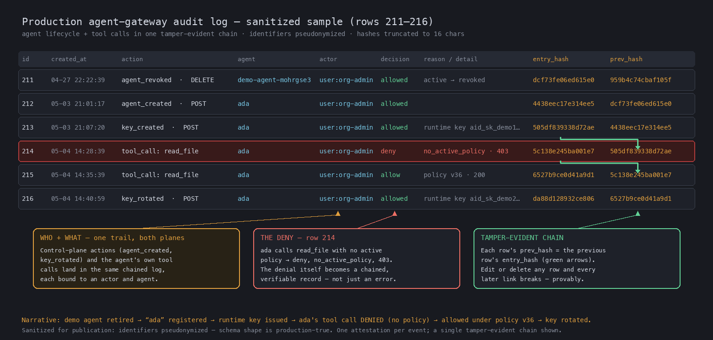

# Tamper-Evident, Attributable Event Records
Jeff Leva

OCSF describes *what happened* — an authentication, a policy decision, a file deletion, an AI agent invoking a tool. But a record rarely stays where it was born. It is produced on an endpoint, enriched at a gateway, then stored and analyzed in a SIEM or data lake. By the time someone reads it as *evidence* — for an audit, an incident investigation, or a regulated or legal review — two questions matter that the schema historically could not answer from the record itself:

1. **Was it altered?** Between the moment it was produced and the moment it is read, did any field change — by mistake, or on purpose?
2. **Is its source verifiable?** Can a third party confirm where it came from, without having to trust every hop in the pipeline that carried it?

Today, a record quietly edited in storage — or a forged event slipped into the stream — looks identical to a genuine one. Nothing in the OCSF record reveals the difference. The `record_integrity` profile and its `attestation` object close that gap. They let a producer attach cryptographic proof that a record has not been altered since it was written, and — when signed — that it came from the holder of a verifiable identity. Crucially, that proof is checkable by anyone, offline, with nothing but the exported JSON.

This article walks through the mental model, where the construct lives in the schema, what the object carries, and how a third party verifies it.

## A chain: each record seals the one before it

The core idea is a hash chain. Each record carries a fingerprint of its own canonical bytes, and a pointer to the fingerprint of the record before it:

- `entry_hash` — the fingerprint of *this* record's canonical serialization.
- `prev_entry_hash` — the `entry_hash` of the previous record in the chain.
- `chain_uid` — an identifier for the chain as a whole (for example, a single agent session or an append-only audit log), so a verifier can locate and order its members. It names the chain itself; it is not a pointer to anything outside the record.
- `uid` — identifies this individual attestation, distinct from the chain it belongs to.

Because each record commits to the one before it, changing *any* record changes its `entry_hash`, which no longer matches the `prev_entry_hash` of the record that follows — and every later link breaks in turn. Deletion and reordering are detectable for the same reason: the chain of fingerprints no longer lines up.

```
Record N-1            Record N                       Record N+1
entry_hash: 7c1b92…   prev_entry_hash: 7c1b92…       prev_entry_hash: 46775c…
                      entry_hash:      46775c…       entry_hash:      e5e15e…

   N's prev == (N-1)'s entry            N+1's prev == N's entry
```

## Where it lives in OCSF: an optional profile on the base event

Record integrity is not a new class and not an AI-specific feature. It is a domain-agnostic **profile** applied at `base_event`, so that *any* event class can opt in to carrying an attestation, and none is forced to.

```
base_event  +  record_integrity profile  =  any event can attest
(every class      optional; adds the         API Activity, Findings,
 inherits it)     attestation attribute       IAM, File System Activity…
```

A class carries an attestation only when its producer chooses to populate one — the profile is opt-in and the `attestation` attribute is optional. The same object works equally well for endpoint telemetry, a detection finding, a configuration file, or an AI agent's activity. Agent activity (the `ai_operation` profile) is simply the *first consumer* that motivated the work; when attesting agent events, a producer applies both profiles together, because the attestation itself is not AI-specific.

This placement mirrors how OCSF profiles are meant to work: a focused, reusable set of attributes that cuts across categories and classes, rather than a proliferation of new classes.

## What the object carries: two jobs, "who" and "unaltered"

The `attestation` object does two independent jobs, and it is worth being precise about which mechanism provides which property, because the object is valid with either one alone.

| Field(s) | Job | Property provided | Keys required? |
|---|---|---|---|
| `signatures[]` | **Who** | Producer **authenticity** and **non-repudiation** | Yes |
| `entry_hash`, `prev_entry_hash`, `chain_uid` | **Unaltered** | **Integrity** and tamper-evident **ordering** | No |

- **`signatures`** is one or more `digital_signature` objects computed over a canonical serialization of the record. The first is typically the producer; additional entries carry a co-signature, notary, or witness over the same bytes. Signatures are what bind a record to a verifiable identity — the *authenticity* and *non-repudiation* half.
- **The hash-chain fields** provide *integrity* and *ordering* with no key management at all. A hash chain is tamper-*evident*: given an independent reference point — a signature anchoring the chain, or a verifier who already holds a trusted earlier fingerprint — any in-place edit, deletion, or reordering becomes detectable.

Because the two capabilities are independent, the object requires at least one of them rather than both:

```json
"constraints": {
  "at_least_one": ["signatures", "entry_hash"]
}
```

An attestation must therefore carry a signature, a chain link, or both. A pure hash chain gives you tamper-evidence without any PKI; adding signatures gives you attribution on top. Signed *and* chained is the strongest combination — a verifier holding nothing but the exported JSON can confirm both who produced each record and that its position in the chain was not rewritten, because the signature's canonical input includes the chain coordinates.

A minimal signed, chained attestation on an event looks like this:

```json
"attestation": {
  "uid": "att-9f2c…",
  "chain_uid": "session-7c1b92e4",
  "prev_entry_hash": "7c1b92…",
  "entry_hash": "46775c…",
  "signatures": [
    {
      "algorithm_id": 1,
      "serialization_id": 1,
      "created_time": 1782000000000,
      "certificate": { "…": "per the OCSF digital_signature object" }
    }
  ]
}
```

The `serialization_id` on each `digital_signature` (added alongside `serialization` in a companion change) declares the canonical-bytes rule — JCS, JWS, COSE, DSSE — so a verifier knows exactly which bytes were signed. `entry_hash` is a fingerprint of the record's canonical serialization and is excluded from its own input, since an output cannot be part of its own computation.

### A note on identity and framing

The verifiable identity in an attestation is a **technical credential** — a key or a certificate. It is deliberately *not* an attribution of any person, organization, or state. Where an event also carries a `user` attribute, that is the technical entity and remains optional. This keeps the construct neutral and avoids overreaching into claims about real-world actors — it proves that the holder of a particular key produced a particular record, and nothing more.

## The use cases the community already named

The construct is generic, and the demand for it showed up across domains before it was AI-specific:

- **Telemetry provenance.** *"How do I know this telemetry really came from that router or host?"* A signature binds the record to the source's verifiable identity.
- **Detection-finding origin.** *"Prove this finding really came from that security product, unaltered."* The producer signs the finding; consumers verify without trusting the transport.
- **Endpoint-to-cloud relay.** An event is produced on an endpoint, then relayed to the cloud. The endpoint signs it; the cloud co-signs that it received *this exact record*, unaltered — a verifiable hand-off, i.e. a chain of custody.
- **Agent audit and regulated data.** An AI agent deletes a HIPAA-governed record. A tamper-evident chain of signed records establishes the full chain of custody as court-defensible evidence.

## It works — and you can check it yourself

The point of "checkable by anyone, offline" is that verification requires no special infrastructure — no access to the producer, no trust in the pipeline, just the exported records and a public key. A standalone verifier, using only a language's standard library, recomputes each record's canonical bytes, checks the fingerprint, and follows the chain.

Given an intact three-record chain, verification passes:

```
Entry #1  read_ticket   ✓
Entry #2  lookup_order   ✓
Entry #3  issue_refund   ✓

CHAIN INTACT ✓  3/3 verified
```

Now alter a single field in record #3 after the fact — flip a denied action to look successful — and re-run the same verifier:

```
Entry #3  issue_refund
  CHAIN BROKEN ✗
  claimed:  8a1cc9a1…
  computed: e5e15e60…
  ALTERED after written.
```

The edit is not prevented — nothing stops someone with write access from changing stored bytes. What changes is that the edit is now *evident*, and the original record remains *attributable*. This same shape runs in production today against live OCSF event chains, and the verifier reproduces the result with nothing but a standard library.

The following is a sanitized window from a production agent-gateway audit log. Control-plane actions (an agent created, a key rotated) and the agent's own tool calls land in one chained trail, each bound to an actor and agent. Note row 214: a `read_file` tool call is **denied** by policy (`no_active_policy`, 403) — the denial itself becomes a chained, verifiable record, not just a transient error. Each row's `prev_hash` is the previous row's `entry_hash`; alter or delete any row and every later link breaks.



## What's next: proving one of a million in O(log N)

A hash chain is tamper-evident, but proving that a *single* event is committed means walking the chain — O(N) — with one signature per record. A signed **Merkle checkpoint** over a batch of records addresses both costs, and it is purely additive: nothing in the base construct changes.

| | Chain attestation | + checkpoint layer |
|---|---|---|
| Prove one event | walk the chain — O(N) | inclusion proof — O(log N) (~20 hashes for a million) |
| Signatures | one per event | one covers the whole batch |
| Verifier needs | the chain | one signed root + the public key |

This follows the RFC 6962 transparency-log model: the Merkle leaves *are* the existing `entry_hash` values, a signed checkpoint carries the `merkle_root` and `tree_size`, and an inclusion proof carries the `audit_path`. It is a natural follow-on rather than part of the core construct, and a standalone offline verifier for it already runs.

## Summary

The `record_integrity` profile gives OCSF a domain-agnostic, opt-in way to make records tamper-evident and attributable:

- A **hash chain** (`entry_hash`, `prev_entry_hash`, `chain_uid`) provides integrity and ordering with no keys.
- **Signatures** provide producer authenticity and non-repudiation.
- An `at_least_one` constraint means an attestation must carry at least one of these; together they are strongest.
- It applies at `base_event`, so any class can adopt it; `ai_operation` is simply the first consumer.
- Verification is standalone and offline — anyone holding the records and a public key can check them.

OCSF has always described what happened. Record integrity lets the record also prove that it is *intact* and *authentic* — the property that matters most exactly when a record becomes evidence.

---

*Reference: the `attestation` object and `record_integrity` profile — [ocsf/ocsf-schema #1661](https://github.com/ocsf/ocsf-schema/pull/1661).*

<!-- ────────────────────────────────────────────────────────────────────────
WHAT TO WATCH FOR — reviewer's note, STRIP before submitting to ocsf-docs
──────────────────────────────────────────────────────────────────────────
VENUE: ocsf/ocsf-docs → articles/  (submit as a PR; add an index line to
articles/README.md; Paul Agbabian is the likely reviewer — this is bylined
like his own "profiles-are-powerful.md").

STYLE CHECK done against the 5 existing articles: prose + JSON code blocks,
1000–3000 words, practitioner audience, title + author-name-on-line-2 byline.
This draft matches that. ~1,600 words.

IMAGES: the 5 existing articles are image-free. This article carries ONE image
(the production audit-log sample) — included at ANIA'S EXPLICIT REQUEST. Note
that in the PR description so it doesn't read as a vendor screenshot slipped in.
- Commit the PNG into ocsf-docs at articles/images/record-integrity-production-log.png
  (the path the embed references). Ready-to-use file:
  docs/cosai-ws4-ocsf-mapping/images/record-integrity-production-log.png.
- RESOLVED (was a blocker): the PR-era img_4 had a stale 4th callout ("SECOND CHAIN,
  SAME EVENT (Q4/Q5) … why the PR proposes an array of attestations") that CONTRADICTS
  the shipped design (#1661 = ONE attestation object per event + signatures[] array;
  the array-of-attestations model was rejected 2026-06-23 after Ania's pushback).
  A CORRECTED figure was regenerated for this article: org-chain columns
  (entry_hash_org / prev_hash_org / seq) dropped and the Q4/Q5 callout removed;
  the three accurate callouts (WHO+WHAT / THE DENY row 214 / TAMPER-EVIDENT CHAIN)
  kept. Generator: docs/ocsf-pr1661-educational/gen_production_sample_article.py.
  NOTE: the live PR (#1661) still references the OLD img_4 with the stale callout —
  decide separately whether to refresh that on the PR too.

NEUTRALITY (deliberate changes from the deck):
- Dropped the "Ready for 1.9 / merge my PR" ask slide entirely — an article
  is timeless/educational, not PR advocacy.
- Removed the vendor metric ("AI Identity gateway · 157 events · 29 agents").
  Replaced with a neutral "runs in production today." Credit is in the byline.
- No AI Identity product naming anywhere in the body. Keep it that way.

ACCURACY — verify before sending (no vaporware; Paul/Mike/Ania probe hard):
- The verifier output blocks (intact / altered) are illustrative, matching the
  deck. Regenerate from the real verifier if you want exact hashes.
- The JSON attestation instance is ILLUSTRATIVE (field names for the attestation
  object are real: uid/chain_uid/entry_hash/prev_entry_hash/signatures +
  at_least_one(signatures, entry_hash) constraint). The inner digital_signature
  fields are gestured at, not exhaustively specified — confirm against the OCSF
  digital_signature object before claiming exact field names.
- "serialization_id … JCS/JWS/COSE/DSSE" references the companion #1662 change.
  Only describe it as merged once it is.
- The Merkle-checkpoint section describes FUTURE, prototyped-but-unmerged work
  ("a standalone offline verifier for it already runs" is true per the deck).
  Keep it clearly framed as a follow-on, not shipped in #1661.
- The two-tier framing (hash = integrity/tamper-evidence; signatures =
  authenticity/non-repudiation) is the corrected, precise version — matches the
  MR discussion. Do NOT flatten back to "provides integrity, authenticity,
  and non-repudiation" as one blanket claim.

Title alternatives if Paul prefers: "Record Integrity in OCSF" /
"Attesting Event Records".
──────────────────────────────────────────────────────────────────────────── -->
