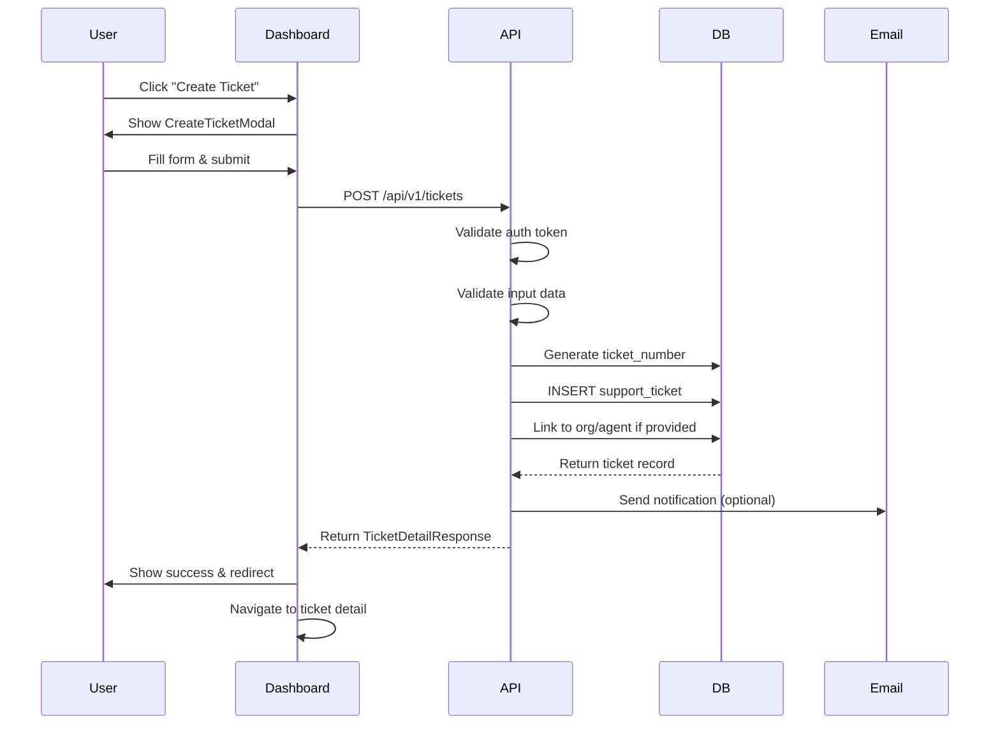
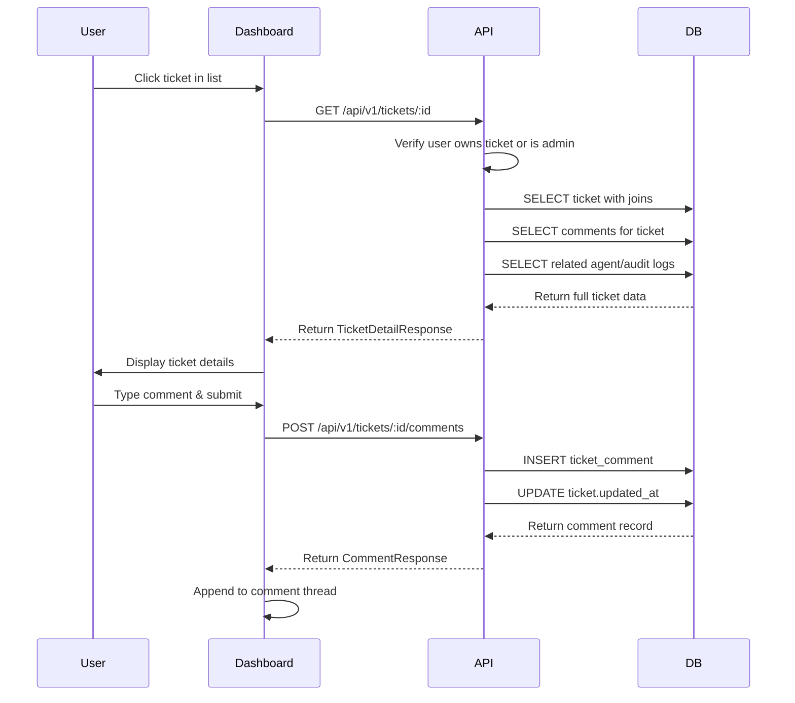
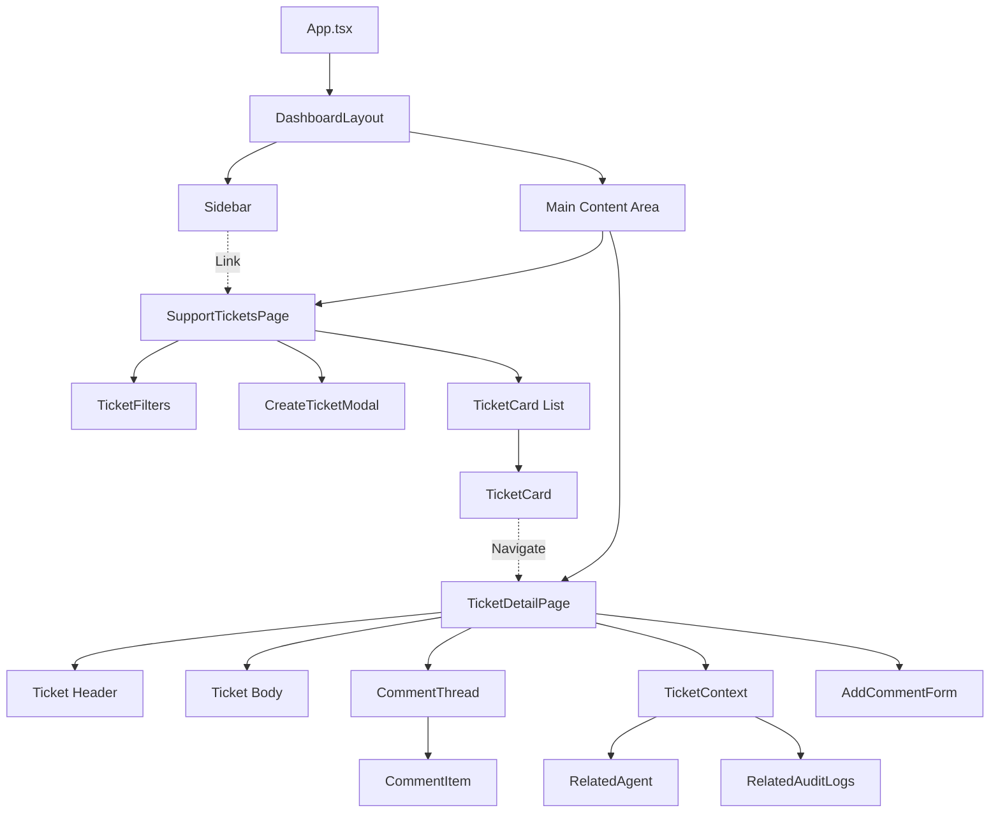
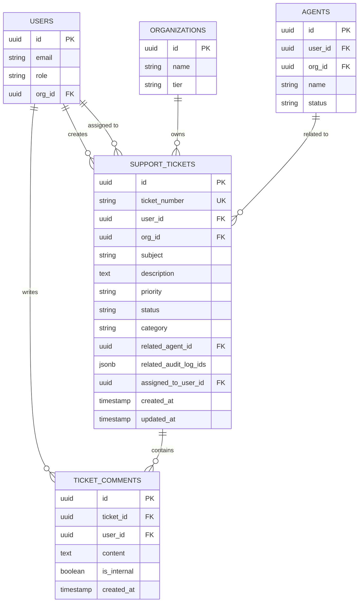
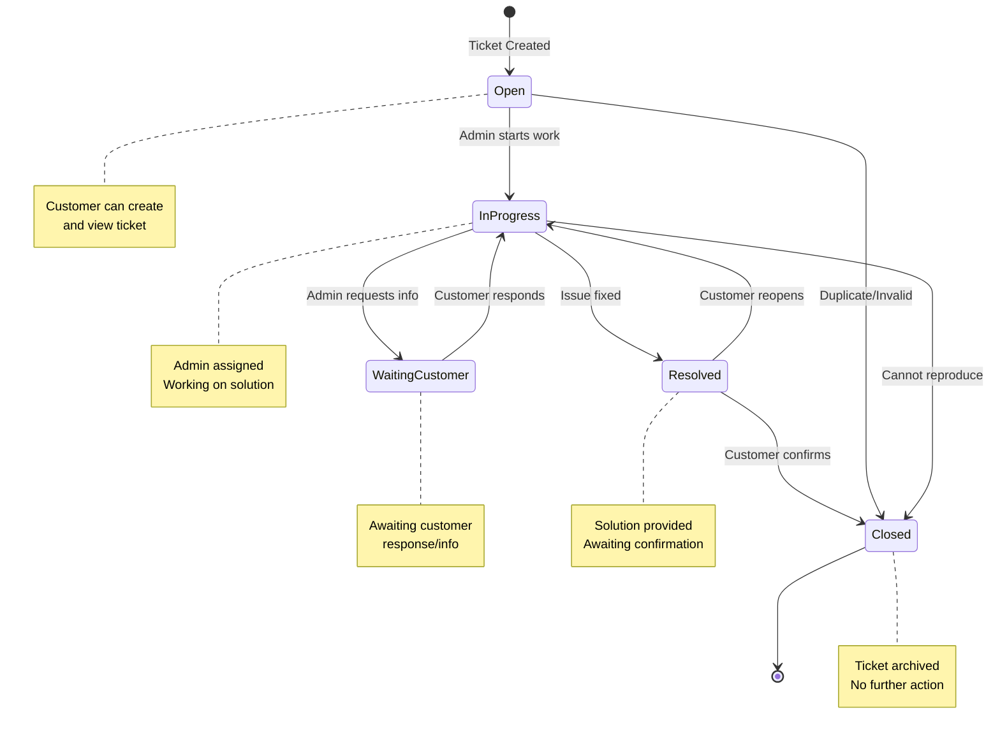
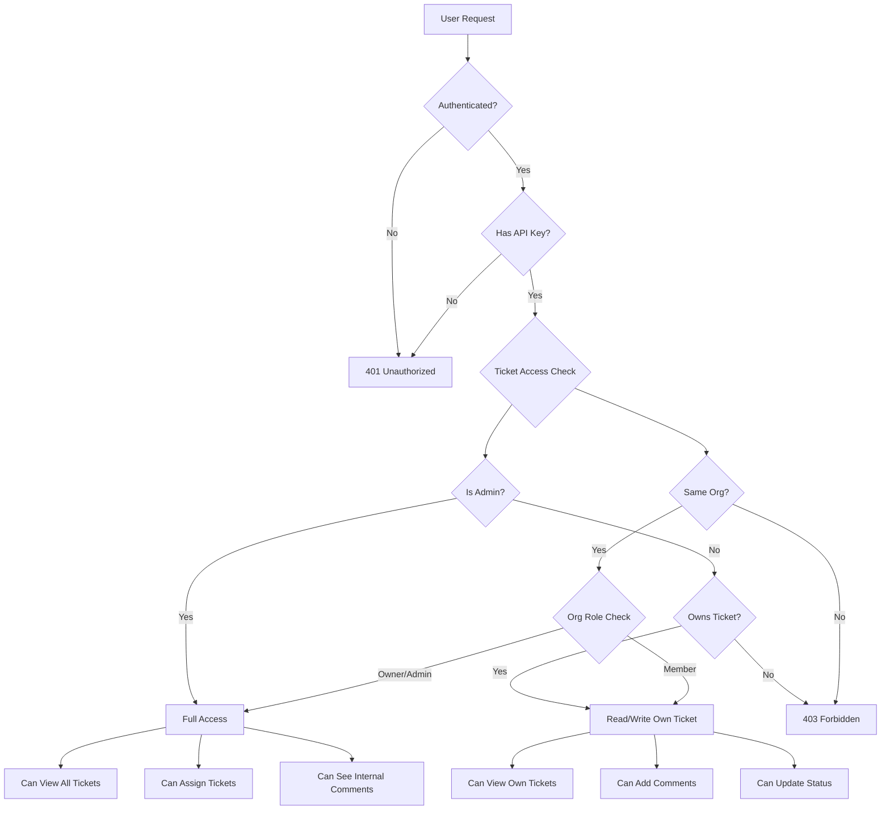
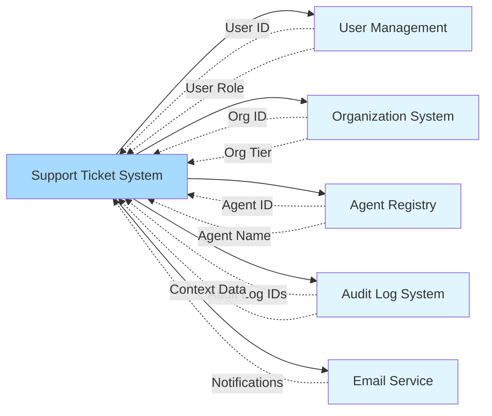
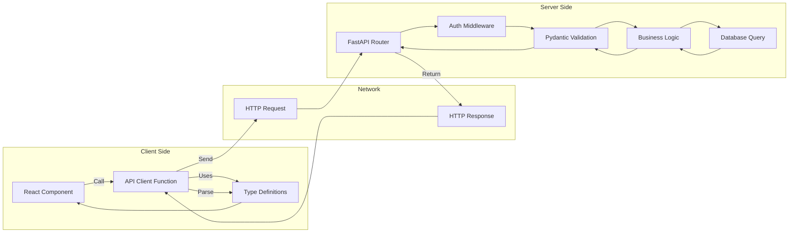

# Support Ticket System - Architecture Diagram

## System Architecture

```mermaid
graph TB
    subgraph "Frontend - React Dashboard"
        A[SupportTicketsPage] --> B[TicketCard]
        A --> C[TicketFilters]
        A --> D[CreateTicketModal]
        E[TicketDetailPage] --> F[CommentThread]
        E --> G[TicketContext]
        E --> H[AddCommentForm]

        I[Sidebar] -.->|Navigate| A
        I -.->|Navigate| E
    end

    subgraph "API Layer"
        J[/api/v1/tickets]
        K[/api/v1/tickets/:id]
        L[/api/v1/tickets/:id/comments]
        M[/api/v1/tickets/:id/context]
    end

    subgraph "Backend - FastAPI"
        N[support_tickets.py Router]
        O[Auth Middleware]
        P[Ticket Service Logic]
    end

    subgraph "Database - PostgreSQL"
        Q[(support_tickets)]
        R[(ticket_comments)]
        S[(users)]
        T[(organizations)]
        U[(agents)]
        V[(audit_log)]
    end

    A -->|HTTP GET| J
    D -->|HTTP POST| J
    E -->|HTTP GET| K
    E -->|HTTP PATCH| K
    H -->|HTTP POST| L
    E -->|HTTP GET| M

    J --> N
    K --> N
    L --> N
    M --> N

    N --> O
    O --> P

    P --> Q
    P --> R
    P --> S
    P --> T
    P --> U
    P --> V

    Q -.->|FK| S
    Q -.->|FK| T
    Q -.->|FK| U
    R -.->|FK| Q
    R -.->|FK| S
```

## Data Flow - Create Ticket



## Data Flow - View & Comment



## Component Hierarchy



## Database Relationships



## State Management



## Security Model



## Integration Points



## API Request/Response Flow



## Deployment Architecture

```mermaid
graph TB
    subgraph "Client Browser"
        A[React SPA]
    end

    subgraph "Vercel CDN"
        B[Static Assets]
        C[Dashboard Bundle]
    end

    subgraph "Google Cloud Platform"
        D[Cloud Run - API]
        E[Cloud SQL - PostgreSQL]
        F[Cloud Storage]
    end

    subgraph "External Services"
        G[SendGrid Email]
        H[Sentry Monitoring]
    end

    A -->|HTTPS| B
    A -->|HTTPS| C
    A -->|API Calls| D
    D -->|Query| E
    D -->|Store Files| F
    D -->|Send Email| G
    D -->|Error Tracking| H

    style A fill:#A6DAFF
    style D fill:#A6DAFF
    style E fill:#A6DAFF
